<p align="center">
    <a href="https://github.com/MarlonBeloMarques/PromoBV-frontend">
    
  </a>
</p>
<h1 align="center">
PromoBV - Mobile
</h1>

<p align="center">
  <a href="https://github.com/MarlonBeloMarques">
    
  </a>
</p>
<p align="center">
  
  
  
  
  
</p>

O PromoBV é uma aplicação onde o usuário pode compartilhar suas promoções de diversas categorias. Esse é um projeto completo desde o back-end ao front-end(mobile). Aqui você encontrará os detalhes para rodar localmente a aplicação mobile. Para que possa ser totalmente util a aplicação mobile, você pode encontrar o projeto back-end [aqui](https://github.com/MarlonBeloMarques/promobv-backend) e realizar a comunicação localmente. Para configurar o back-end e rodar localmente, veja os detalhes no readme do projeto back-end.

Esse é um projeto que foi idealizado pela [Larissa Pantoja](https://github.com/Pantoja49).

<p align="center"
    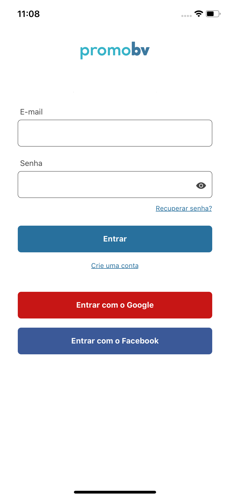
    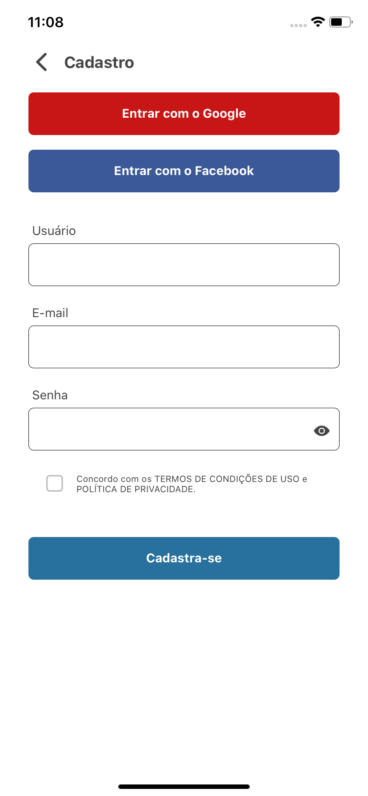
    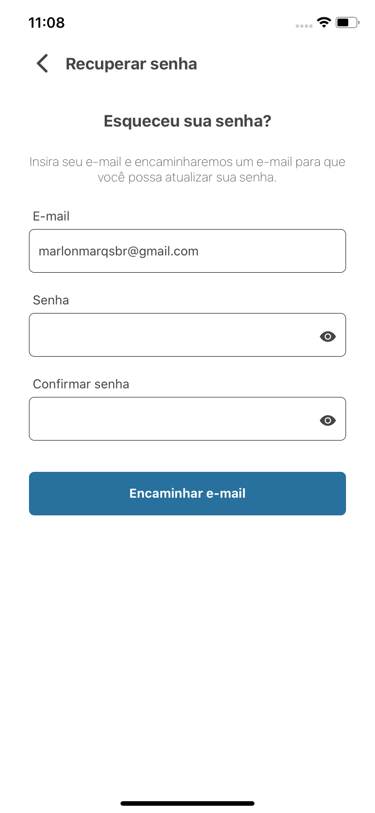
    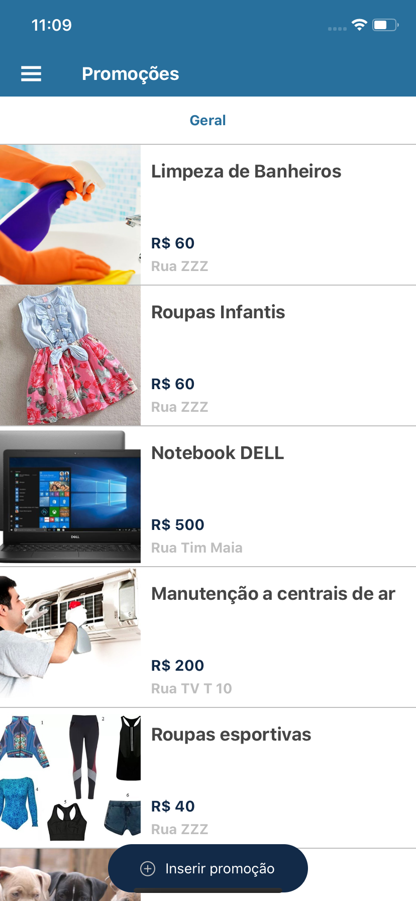
    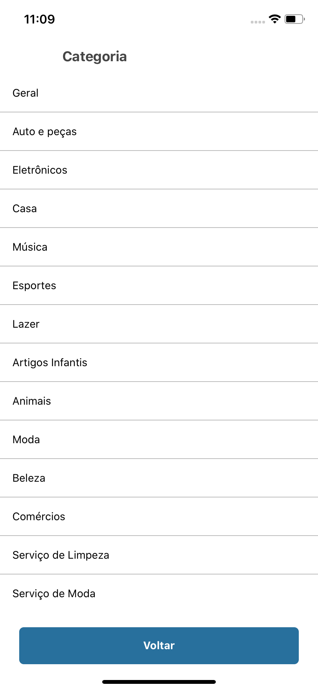
    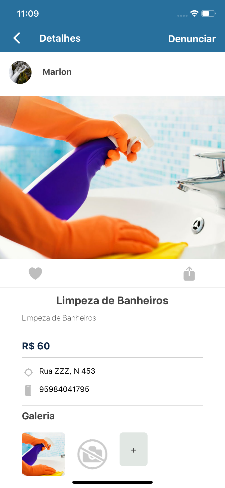
    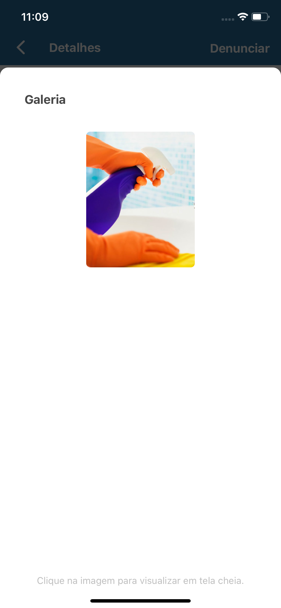
    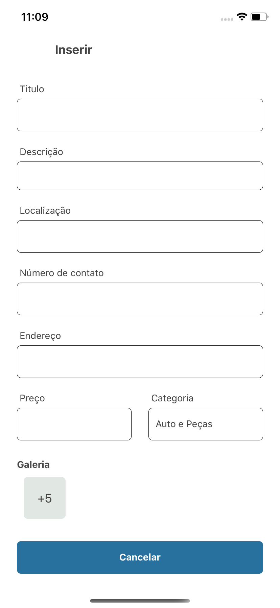
    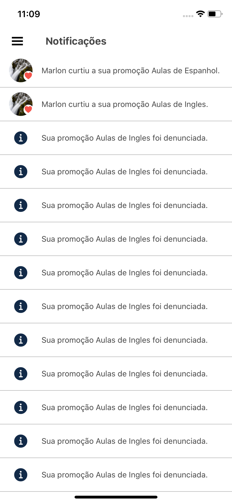
    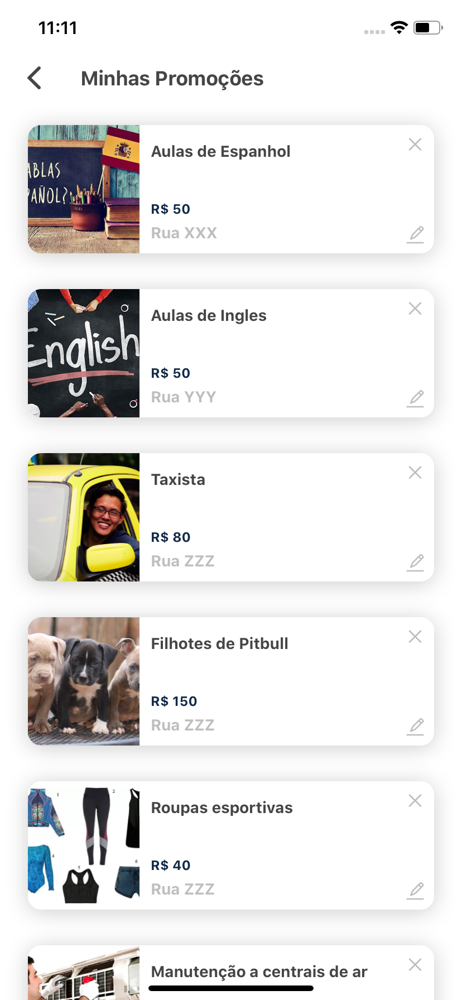
    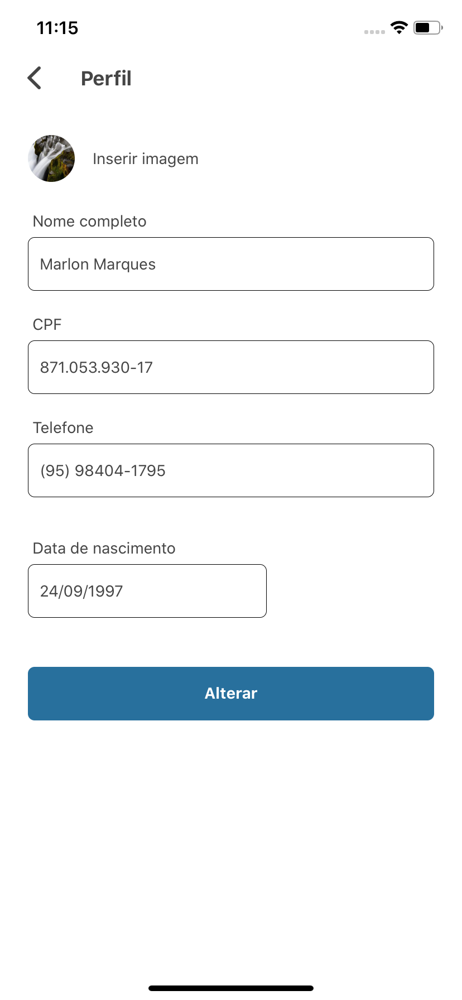
    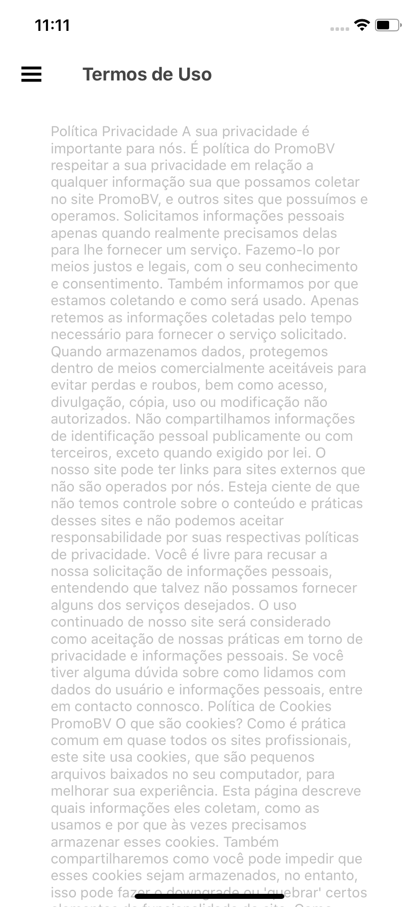
</p>

## :star: O que você pode fazer?

* Cadastro e Acesso em duas etapas por e-mail
* Alterar senha em duas etapas por e-mail
* Acesso por email e senha
* Acesso por google ou facebook utilizando Oauth2
* Alterar informações do usuário
* Adicionar promoções
* Alterar promoções
* Deletar promoções
* Curtir promoções
* Denunciar promoções
* Buscar todas promoções
* Buscar promoções por categoria
* Compartilhar promoções
* Buscar categorias
* E muito mais...

## :monocle_face: Pré-requisitos

Para executar qualquer aplicativo React Native/Expo, você precisa configurar o ambiente em sua máquina.
Definir o ambiente é um processo complexo, por isso recomendo seguir a documentação do Expo:

* [**Introdução Expo**](https://expo.io/learn)


## :boom: Clone

- Clone esse repositório em sua máquina

```
https://github.com/MarlonBeloMarques/promobv-mobile
```

## :rocket: Começando
Para que a aplicação mobile seja totalmente util, você precisa estar rodando o back-end para realizar a comunicação e assim fazer login e as demais funcionalidades.
Considerando que o seu back-end está ok e rodando. Navegue até `config.js` e adicione as URLs conforme o seu ambiente:
        
    export const API_BASE_URL = "http://localhost:8080";
    export const APP_URL = "exp://192.168.4.8:19000";
Com isso feito, seu projeto já está configurado :sunglasses:.
    
### Iniciando

Execute esses comandos no local do projeto:
```sh
$ yarn
$ yarn start
```

- Baixe o [Expo](https://play.google.com/store/apps/details?id=host.exp.exponent&hl=pt_BR) em seu dispositivo e leia o Qr Code.

## :pushpin: Suporte

Entre em contato comigo em um dos seguintes lugares!

- Instagram em [@marlomarquesbr](https://www.instagram.com/marlonmarqsbr/)
- Linkedin em [Marlon Marques](https://www.linkedin.com/in/marlon-marques-0b509813b/)
